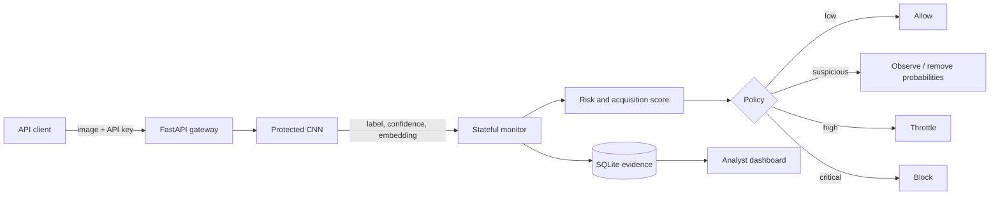
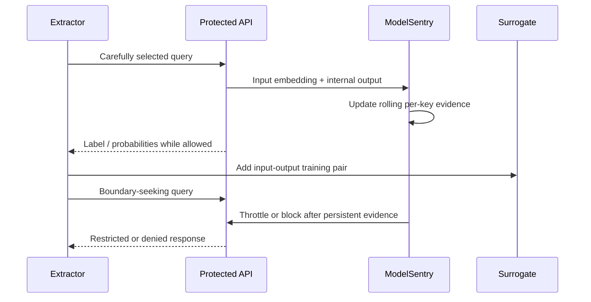

# ModelSentry architecture and threat model

## Business deployment

The buyer is a government AI-platform or security-operations team operating
proprietary prediction APIs. ModelSentry replaces manual log review and augments
basic rate limiting with stateful, model-aware evidence.

## Attack sequence

## Detection signals

| Signal | Security interpretation |
|---|---|
| Query rate | Sustained or accelerated harvesting |
| Embedding diversity | Broad exploration of the input domain |
| Sequential distance | Structured perturbation or search behavior |
| Boundary frequency | Concentration on information-rich uncertain outputs |
| Class coverage | Systematic exploration of output behavior |
| Acquisition proxy | Novelty multiplied by boundary value and output richness |

Each signal is converted to an empirical percentile using benign reference
traffic. Enforcement requires persistent, simultaneous extremes rather than one
unusual request.

## Security assumptions

| Assumption | Included |
|---|---|
| Black-box access to owned API | Yes |
| Returned hard labels or probabilities | Yes |
| Different surrogate architecture | Yes |
| Direct weight or database access | No |
| Account rotation / Sybil coordination | Future work |
| Production traffic drift | Future work |

## Privacy boundary

The monitor requires embeddings and output statistics but does not need to retain
raw images. A production implementation should encrypt telemetry, isolate tenants,
apply retention limits, and restrict analyst access.
